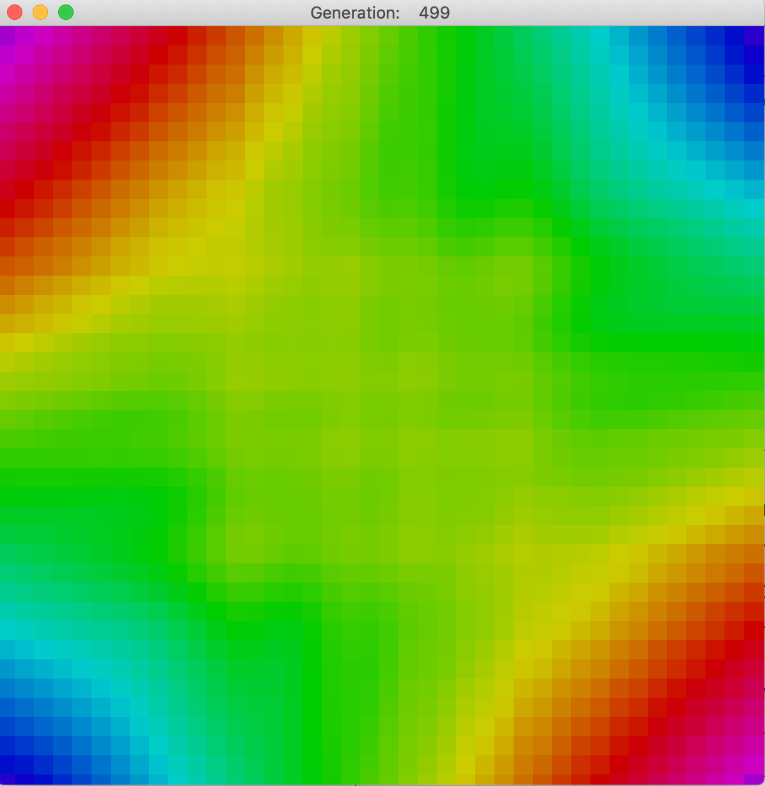

This is a relaxation-method solver for [Laplace's equation](https://en.wikipedia.org/wiki/Laplace%27s_equation) with motion of the lattice. 
Forked from (https://github.com/deltaGPhys/TheGoodLaplace) -> (https://github.com/deltaGPhys/ForestFire) -> (https://github.com/deltaGPhys/ConwayGameOfLife) -> (https://github.com/Zipcoder/ConwayGameOfLife)

### Background
See https://github.com/deltaGPhys/TheGoodLaplace for background on the equation and the relaxation method for finding numerical solutions.

### Execution
In this implementation, the cells in the array are simulated as if they are discrete parts of a moving lattice. Each element feels an average force
exerted by its neighbors, based on its position relative to theirs, modeled via Hooke's Law (force proportional to displacement and opposite in direction). 
The velocity of
each element is stored and updated using this acceleration as well as a damping factor, which allows the system to come to equilibrium in the long-
time limit. The positions are changed according to the velocity at each step.

As a result, the lattice moves like an elastic sheet, overshooting the equilibrium position and oscillating, eventually damping down to the steady state. 
The 'height' of each cell is illustrated by color, but this time by HSB colors, instead of RGB, to better show the height contrast.

A series of images below show how the animation progresses for a setup with two corners fixed 'high' and two fixed 'low.'

